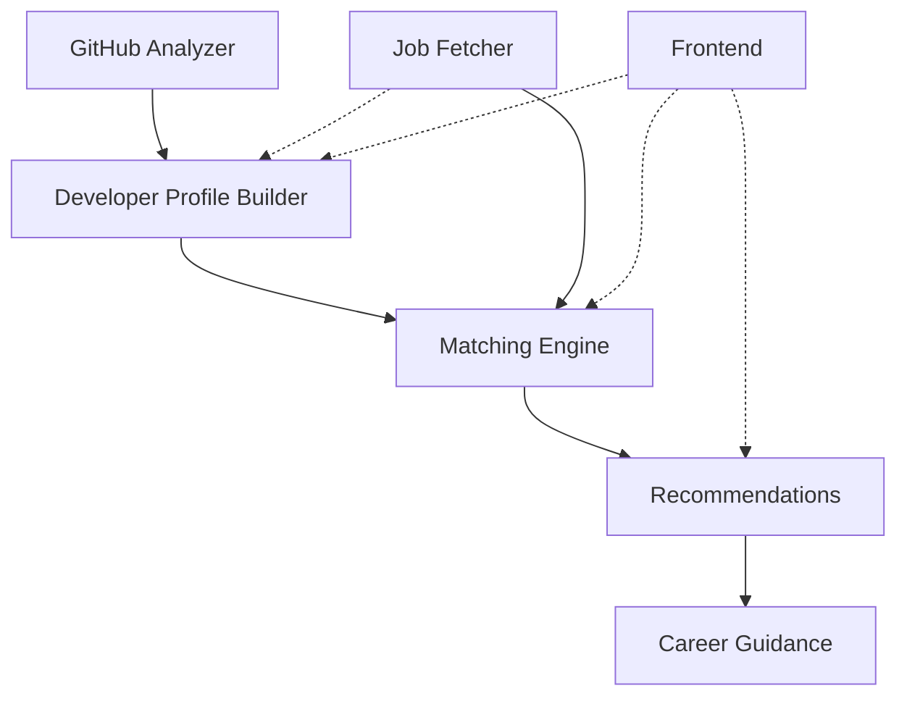

# Career Intelligence Platform

**Turn GitHub profiles into actionable career intelligence**

🚀 Live Demo: https://ai-career-intelligence-platform-uz9x6bpzjrdtyjrks93ujx.streamlit.app/


## Overview

The Career Intelligence Platform is an AI-powered career advancement tool that transforms GitHub profiles into comprehensive developer intelligence. By analyzing public repositories, extracting skills, and matching against live job postings, we provide developers with evidence-backed career guidance, personalized learning roadmaps, and portfolio project suggestions.

## Key Features

- **GitHub Intelligence** — Automated repository analysis with framework detection, quality scoring, and evidence-based skill extraction+
- **Structured Developer Profiles** — Single source of truth containing languages, frameworks, libraries, domains, and confidence scores
- **Live Job Matching** — Real-time job posting retrieval with semantic similarity matching (40%) + skill overlap (40%) + repo quality (20%)
- **Personalized Learning Roadmaps** — Week-by-week curriculum grounded in real resources, not hallucinated course names
- **Portfolio Project Suggestions** — Concrete project ideas mapping directly to skill gaps
- **Complete Explainability** — Every score, recommendation, and match broken down with evidence links

## Architecture



### LangGraph Pipeline

The platform is orchestrated through a LangGraph pipeline:

1. **analyze_github** — Fetches and analyzes GitHub repositories, detects frameworks, evaluates quality
2. **build_profile** — Constructs the structured `DeveloperProfile` object
3. **jobs/matching/recommendations** — Orchestrated directly in the application service facade

All business logic resides in pure, testable services; the graph only manages orchestration.

## Tech Stack

### Backend
- **Python** 3.11+ — Core runtime
- **LangGraph** — Pipeline orchestration and state management
- **Pydantic** — Data validation and serialization
- **PyGithub** — GitHub API interaction
- **Sentence-Transformers** — Local embeddings (`all-MiniLM-L6-v2`)
- **SQLite** — Job cache storage

### AI/ML
- **Sentence Transformers** — CPU-only embeddings for semantic matching
- **Deterministic Scoring** — No LLM calls for scoring, only for explanations
- **Grounded Retrieval** — Learning resources from curated corpus

### Frontend
- **Streamlit** — Interactive dashboard and career guidance interface
- **WebSockets** — Real-time analysis progress updates

### Deployment
- **Docker** — Single-container deployment (CPU-only torch)
- **Render** — Blueprints deployment with auto-scaling
- **Railway** — GitHub-based deployment

## Project Structure

```
backend/
├── app/
│   ├── api/              # HTTP API layer (FastAPI)
│   │   ├── routes/       # Router implementations
│   │   └── deps.py       # Dependency injection & shared services
│   ├── core/             # Core abstractions (config, logging, security)
│   ├── database/         # Database session management
│   ├── graph/            # LangGraph orchestration
│   └── services/         # Business logic domains
│       ├── github/        # Repository analysis & intelligence
│       ├── developer_profile/ # Profile building & scoring
│       ├── jobs/          # Job fetching & enrichment
│       ├── matching/      # Similarity & ranking algorithms
│       ├── recommendations/ # Skill gap & roadmap generation
│       └── evaluation/    # Benchmark CLI & metrics
│
├── data/                  # Persistent storage
│   ├── jobs.db           # Job cache
│   └── evaluation_dataset.json # Benchmark dataset
│
├── docker/               # Docker configurations
├── tests/                # Unit & integration tests
└── requirements.txt      # Dependencies

frontend/
├── app.py                # Streamlit UI
├── backend_client.py     # Direct Python API client
└── report.py             # Markdown report generation

Configuration
├── docker-compose.yml    # Local development setup
├── render.yaml          # Render deployment blueprint
├── railway.json         # Railway deployment config
└── Procfile             # Fallback PaaS builds
```

## AI Pipeline

### 1. GitHub Analysis
- Fetches public repositories via GitHub API
- Parses `setup.py`, `requirements.txt`, `pyproject.toml`, `package.json`
- Analyzes README files for framework documentation
- Detects languages, frameworks, libraries, and engineering practices
- Scores repository quality (tests, CI/CD, documentation coverage)

### 2. Developer Profile
- Consolidates all extracted data into `DeveloperProfile` object
- Calculates deterministic confidence scores for each skill
- Links every skill claim to specific repository and file evidence
- Establishes single source of truth for all downstream modules

### 3. Job Intelligence
- Fetches live postings from Jobicy API (free tier)
- Normalizes JSON payloads to structured `Job` objects
- Extracts required skills using NLP techniques
- Generates local embeddings for semantic matching
- Caches results with configurable TTL (default 6 hours)

### 4. Matching
- Combines three deterministic signals:
  - **40% Semantic Similarity** — Cosine similarity between developer and job embeddings
  - **40% Confidence-Weighted Skill Overlap** — High-confidence skills weighted by importance
  - **20% Repository Quality** — Engineering practices and project diversity
- Produces 0-100 match score with High/Medium/Low confidence classification

### 5. Recommendations
- **Skill Gap Analysis** — Identifies missing skills across 5 categories (Languages, Frameworks, Tools, Databases, Cloud)
- **Learning Roadmap** — Week-by-week curriculum from grounded resource corpus
- **Portfolio Projects** — Concrete project ideas mapping gaps to practical implementations
- **Explainability** — Every recommendation cites evidence and confidence reasoning

## Matching Algorithm

### Mathematical Formulation

The final match score is calculated as:

```
MatchScore = (0.4 × SemanticSimilarity) + (0.4 × ConfidenceWeightedSkillOverlap) + (0.2 × RepositoryQuality)
```

Where:

- **SemanticSimilarity** = cosine(embed(DeveloperProfile), embed(JobDescription))
- **ConfidenceWeightedSkillOverlap** = Σ(skill_i ∈ Job ∩ DeveloperProfile) × confidence_i × importance_weight
- **RepositoryQuality** = Σ(quality_metrics) × diversity_factor

### Deterministic Confidence

Each skill claim carries a confidence score derived from:
- Evidence strength (multiple sources = higher confidence)
- Repository recency and activity
- Consistency across dependency files

### Evidence Architecture

Every inferred skill links back to:
```
Repository — File — Content
├── ai-job-matcher
│   ├── requirements.txt — FastAPI
│   └── main.py — FastAPI()
```

## Embeddings Strategy

### Why Sentence-Transformers?

1. **No GPU Required** — Runs on consumer hardware with CPU-only torch
2. **Offline Capabilities** — Model persists locally, no API calls needed
3. **Balanced Performance** — `all-MiniLM-L6-v2` optimized for semantic similarity
4. **Deterministic Results** — Consistent embeddings across runs
5. **Low Memory Footprint** — ~90MB model size

### Embedding Workflow

```
DeveloperProfile → SentenceTransformer.encode() → Vector(384-dim)
JobDescription   → SentenceTransformer.encode() → Vector(384-dim)
Similarity      → cosine_similarity(v1, v2) → 0.0-1.0
```

## Explainability & Confidence

### Component Breakdown

Every recommendation includes:

1. **Strengths** — Skills and experiences that align with the role
2. **Weaknesses** — Missing skills or areas for improvement
3. **Confidence Score** — Statistical certainty in the profile (typically 65-95%)
4. **Evidence** — GitHub repositories and files supporting each claim

### Trust Architecture

- No black-box predictions: every output is traceable
- Confidence scores based on statistical evidence, not heuristics
- Repository quality as a proxy for engineering competence
- Skill importance weighted by industry demand patterns

## Evaluation Framework

### Benchmark Suite

The platform includes an offline benchmark CLI with comprehensive metrics:

```bash
python -m app.services.evaluation.cli                    # offline benchmark
python -m app.services.evaluation.cli --live             # live pipeline test
python -m app.services.evaluation.cli --langsmith        # LangSmith integration
```

### Metrics Computed

- **Precision@K** — Relevance at top K recommendations
- **Average Precision@10** — Mean average precision
- **Recall@3** — Coverage of relevant jobs
- **Mean Reciprocal Rank (MRR)** — Ranking quality
- **Kendall Tau** — System vs. human ranking agreement
- **Cohen's Kappa** — System-human decision consistency
- **Latency** — Per-stage processing times (P50, P95)

### Evaluation Dataset

Labeled benchmark dataset (3 cases) covering:
- Different experience levels
- Varying repository diversity
- Multiple technology stacks
- Real-world job matching scenarios

## Performance

### Processing Times

- **GitHub Analysis** — 30-60 seconds for typical profiles
- **Job Fetching** — 2-5 seconds (cached in 80% of cases)
- **Full Pipeline** — 60-120 seconds end-to-end

### Memory Usage

- **Model Cache** — 90MB (all-MiniLM-L6-v2)
- **Jobs Database** — ~50MB (historical cache)
- **Peak RAM** — ~2GB on development machines

## Screenshots


## Installation

### Local Development

```bash
# 1. Clone the repository
cd /path/to/career-intelligence-platform

# 2. Backend setup
# In backend directory
cd backend
python -m venv .venv
.venv\Scripts\activate  # Windows
# or source .venv/bin/activate  # Linux/macOS
pip install -r requirements.txt

# 3. Frontend setup
cd ../frontend
pip install -r requirements.txt

# 4. Run the application
cd ..
streamlit run frontend/app.py
# Open http://localhost:8501
```

### Optional GitHub Token

Create `.env` from `.env.example` to increase GitHub API limit from 60 to 5,000 requests/hour.

## Docker

### Standard Setup

```bash
docker compose up --build
# Open http://localhost:8501
```

### Single Image

```bash
docker build -t career-intelligence-platform .
docker run -p 8501:8501 career-intelligence-platform
```

### Development Mode

```bash
docker compose -f docker-compose.yml -f docker-compose.dev.yml up --build
```

## Local Development

### Code Structure

- **backend/app/services/** — Business logic, organized by domain
- **backend/app/graph/** — LangGraph orchestration only
- **backend/app/api/** — HTTP API layer (FastAPI)
- **frontend/** — Streamlit UI

### Testing

```bash
# Run unit tests
cd backend
python -m pytest tests/ -xvs

# Run integration tests
python -m pytest tests/integration/ -xvs
```

### Debugging

Enable LangSmith tracing for detailed pipeline observability:

```bash
export LANGSMITH_API_KEY=lsv2_...
export LANGSMITH_TRACING=true
export LANGSMITH_PROJECT=career-intelligence-debug
```

## Deployment

### Render

1. Push repository to GitHub
2. Go to Render → New → Blueprint
3. Select repository and use `render.yaml` (auto-detected)
4. Set environment variables:
   - `GITHUB_TOKEN` — Optional GitHub API token
   - `LANGSMITH_API_KEY` — Optional LangSmith tracing

### Railway

1. Create new project from GitHub repo
2. Railway auto-detects `Dockerfile` (see `railway.json`)
3. Add variables in service settings:
   - `GITHUB_TOKEN`
   - `LANGSMITH_API_KEY`

### Docker Swarm/Kubernetes

Use the official Docker image with:
```bash
docker compose -f docker-compose.prod.yml up -d
```

## Environment Variables

| Variable | Default | Purpose |
|----------|---------|---------|
| `GITHUB_TOKEN` | — | Increase GitHub API limit 60 → 5,000 req/hr |
| `LANGSMITH_API_KEY` | — | Optional LangSmith tracing/evaluations |
| `LANGSMITH_TRACING` | `false` | Enable tracing when key is set |
| `LANGSMITH_PROJECT` | `career-intelligence-evaluation` | LangSmith project name |
| `EMBEDDING_MODEL` | `sentence-transformers/all-MiniLM-L6-v2` | Embedding model |
| `JOB_API_PROVIDER` | `jobicy` | Job API provider (only `jobicy` implemented) |
| `JOB_CACHE_TTL_HOURS` | `6` | Job cache freshness window |
| `JOB_CACHE_DB` | `backend/data/jobs.db` | SQLite cache path |

## Future Improvements

### Phase 2 (Next 3 Months)
- Manual skills entry for thin profiles
- PDF report export capability
- Enhanced GitHub API rate limit handling

### Phase 3 (Q2 2026)
- Resume parser & ATS scoring
- LinkedIn profile integration
- User accounts and saved histories
- Recruiter dashboard interface

### Phase 4 (Q3 2026)
- Fully autonomous LangGraph nodes for jobs/matching/recommendations
- Expanded learning-resource corpus with true vector RAG
- Interview preparation agent
- Feedback-based ranking improvements

## Why This Project Stands Out

### Technical Excellence
- **Deterministic Scoring** — No black-box AI for critical decisions
- **Evidence-Based Recommendations** — Every suggestion links to real code
- **CPU-Only Architecture** — Runs on standard development machines
- **Production-Ready** — Complete HTTP API, Docker support, monitoring

### Business Impact
- **Actionable Intelligence** — From profile analysis to concrete learning steps
- **Time-Saving** — Automated matching vs. manual job hunting
- **Career Growth** — Data-driven insights for skill prioritization
- **Trust & Transparency** — Explainable AI with verifiable evidence

## Challenges Solved

### GitHub Analysis Complexity
- Multiple dependency file formats (Python, Node.js, Go, etc.)
- Natural language README parsing
- Repository quality scoring across diverse project types

### Job Matching Difficulty
- Free API limitations (Jobicy vs. LinkedIn/Indeed)
- Semantic understanding beyond keyword matching
- Balancing multiple scoring factors without overfitting

### Explainability Requirements
- Confidence scoring without user manipulation
- Evidence linking across thousands of code changes
- Balancing detail with usability in UI

## License

MIT License. See `LICENSE` file for details.

---

*Built with ❤️ by AI engineers for AI engineers. Open to contributions and feedback!*
